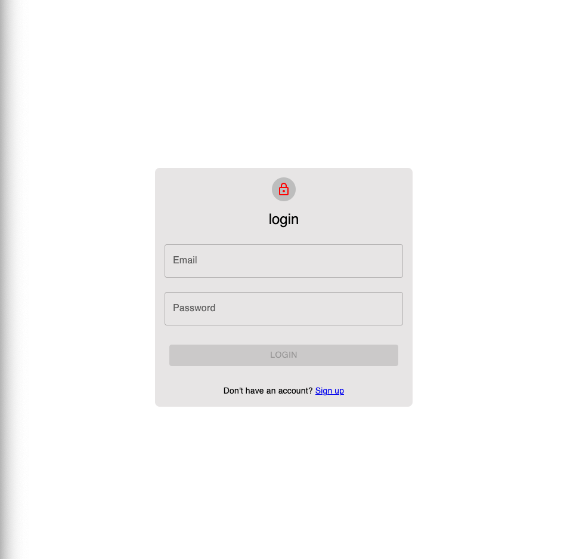
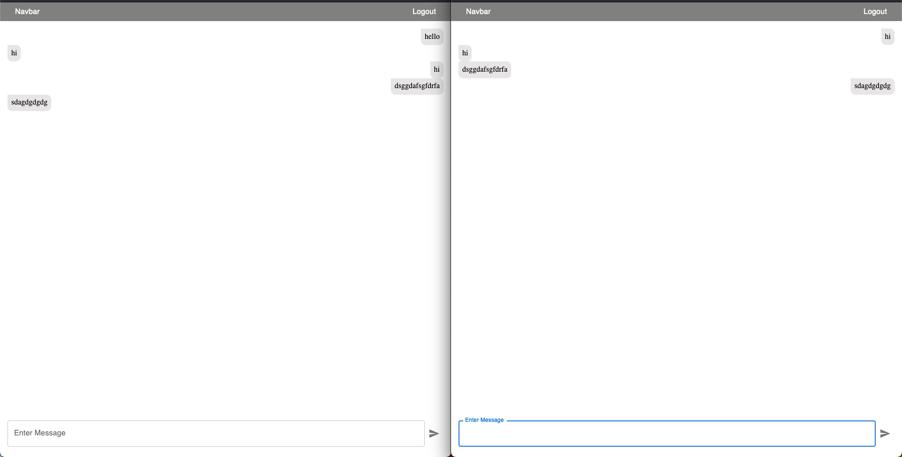

# Socket io and React and Express Chat App Demostration

## Intension of this project

Demosntrate the use of socket.io with react and express. This project is a chat app that allows users to create rooms and chat with each other. The backend is built with express and socket.io. The frontend is built with react and socket.io-client.

### Packages Used In backend

- [socket.io](https://socket.io/)
- [express](https://expressjs.com/)
- [mongoose](https://mongoosejs.com/)
- [pino for logging](https://github.com/pinojs/pino)
- [tsx for dev server](https://github.com/privatenumber/tsx)

### Packages Used In frontend

- [react](https://reactjs.org/)
- [react-dom](https://reactjs.org/)
- [socket.io-client](https://socket.io/)
- [mui](https://mui.com/)
- [zustand](https://github.com/pmndrs/zustand)
- [react-router-dom](https://reactrouter.com/)
- [react-query](https://react-query.tanstack.com/)

### How to run this project

1. Clone this project
2. Run `npm install` in both backend and frontend folder
3. Run `npm run dev` in backend folder
4. Run `npm start` in frontend folder

### Screenshots

